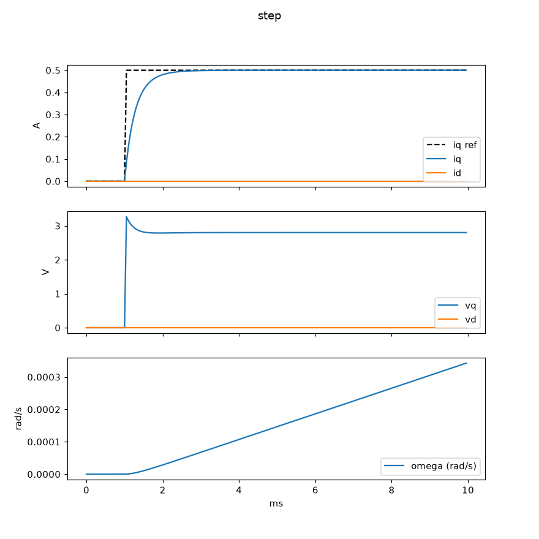
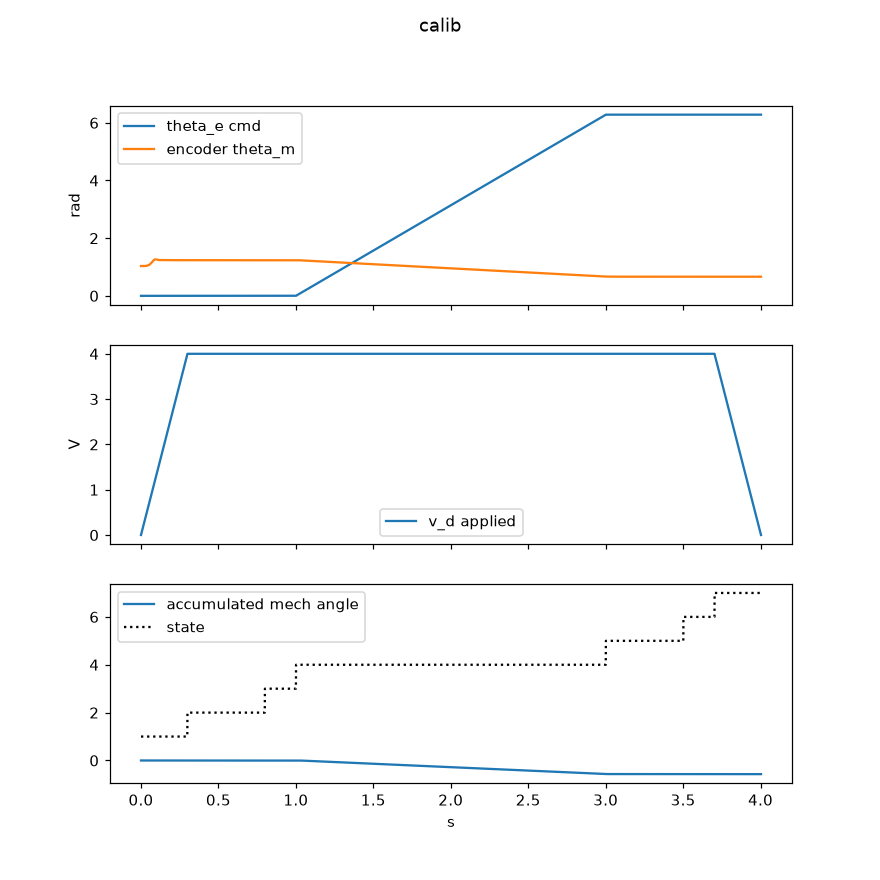
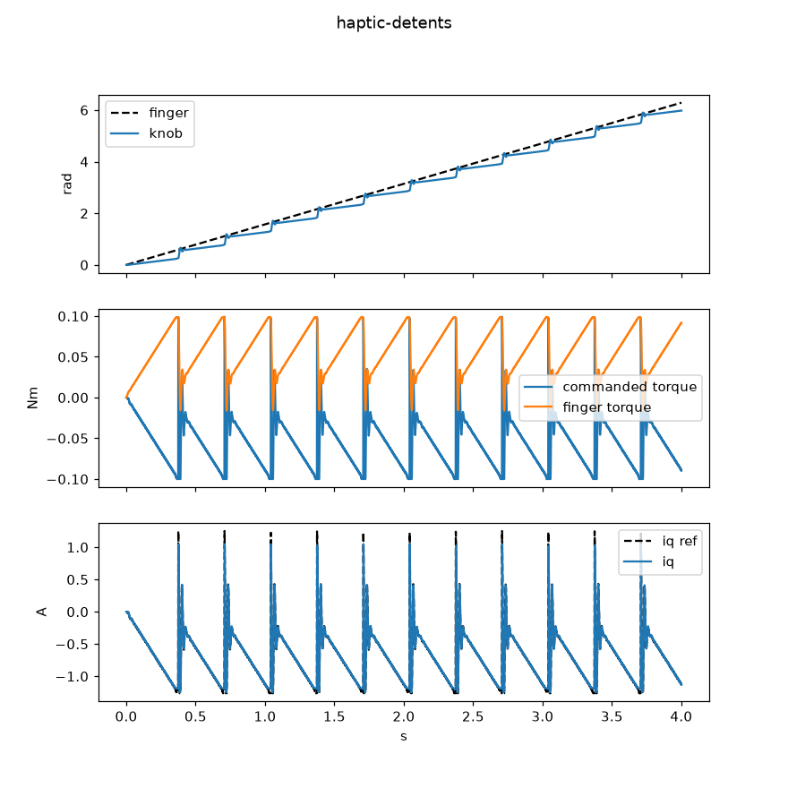
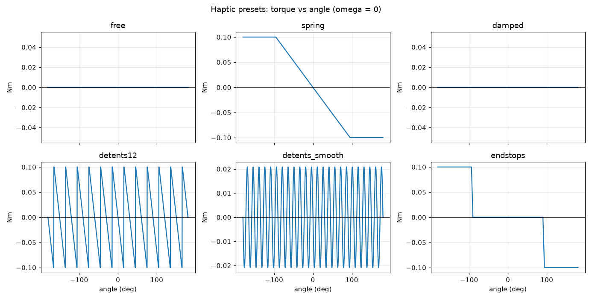

# FOC Actuator

Field-oriented control firmware for a brushless gimbal motor, written from scratch on an STM32G431. The goal is torque control: command a force and have the motor deliver it. That is the building block of a robot joint, and the demo target is a haptic knob that pushes back when you turn it.

[](https://github.com/johnppilli/foc-actuator/actions/workflows/ci.yml)

## Hardware

- B-G431B-ESC1 driver board (STM32G431, gate driver, and current shunts on one board)
- Small brushless gimbal motor
- AS5600 magnetic encoder over I2C
- Bench power supply

## How it is put together

The control math is a plain-C library with no hardware dependencies. The same source files are compiled into the firmware, into a desktop test suite, and into a closed-loop simulator with a motor model, so every piece of the loop was exercised before it touched the board.

```
foc/            the library (C99, float only, no allocation, no printf)
  foc.[ch]        Clarke/Park and inverses, PI with anti-windup, dq current controller
  svpwm.[ch]      space-vector PWM (min/max injection + classic sector form for cross-checks)
  encoder.[ch]    AS5600 processing: wrap, multi-turn, filtered velocity, mech->elec angle
  calib.[ch]      encoder offset / direction / pole-pair calibration state machine
  impedance.[ch]  haptic torque laws: spring, damper, sawtooth/sine detents, end stops, presets
  telemetry.[ch]  binary telemetry frame codec + SPSC ring buffer
sim/            PMSM model (dq equations + mechanics + encoder mounting) and scenario driver
tests/          unit + closed-loop tests, one executable per module (`make test`)
tools/          plot_sim.py, plot_haptic.py, telemetry.py (serial console / decoder)
firmware/       STM32CubeIDE project; also builds with `make -C firmware`
  Core/Src/foc_loop.c        the 20 kHz loop and mode state machine (idle/open/calib/torque/haptic)
  Core/Src/board_current.c   op-amps + ADC injected sampling synced to the PWM peak
  Core/Src/board_pwm.c       TIM1 CH4 ADC trigger, safe idle state
  Core/Src/board_encoder.c   non-blocking AS5600 reads
  Core/Src/board_serial.c    USART2 command console + telemetry stream
  Core/Inc/board.h           every board/motor constant in one place
```

### The loop

Once per PWM period (20 kHz) the ADC finishes sampling the shunts and raises an interrupt. In that interrupt: convert counts to amps and trip on overcurrent; pick up the latest encoder reading (kicked off every 4th tick, completes in the I2C interrupt); run the active mode; write the three duty cycles; queue a telemetry frame every 20th tick. The main loop only drains telemetry to the UART and parses commands.

Torque mode is the classic pipeline: `ia, ib -> Clarke -> Park(theta_e) -> two PI loops (d held at 0, q = torque) -> inverse Park -> SVPWM -> duties`. The PI gains come from pole placement on the motor's R and L (`foc_pi_tune_current`), so the current loop bandwidth is a number you choose (500 Hz by default), not something you hunt for.

Haptic mode wraps that with an impedance law: the encoder gives angle and velocity, `haptic_torque()` turns them into a torque, and `iq_ref = torque / kt`.

## Desktop: build, test, simulate

```
make test        # 7 test binaries, ~127k checks
make plots       # runs every simulator scenario and renders PNGs into build/
                 # needs: pip install numpy matplotlib
```

Scenarios (`./build/focsim <name>`): `step`, `step-free`, `load`, `calib`, `haptic-spring`, `haptic-detents`, `haptic-endstops`, `openloop`, `haptic-curves`.

Current-loop step on the simulated motor, 500 Hz bandwidth: first-order rise, no overshoot, `vq` settles at `I*R`, `id` stays at zero.



Calibration on a motor whose encoder is mounted backwards with an arbitrary offset: the routine locks the rotor, turns one electrical revolution, and recovers 11 pole pairs, direction -1, and the offset to within 0.01 rad.



Twelve detents, with a simulated finger dragging the knob through one turn. Torque builds to the clamp, then the knob snaps into the next cell.



Torque-vs-angle curves for the built-in presets (`make plots` regenerates this from the C code, so the picture is what the firmware commands):



The closed-loop tests in `tests/test_sim.c` assert on these behaviours (rise time, overshoot, steady-state error, voltage-limit saturation, calibration accuracy, spring deflection with both encoder directions), and `test_angle_error_kills_torque` shows why the calibration step exists: with a 90-degree electrical angle error the same command produces no torque.

## Firmware

**CubeIDE:** open `firmware/`. The `foc/` directory is linked into the project and on the include path.

**Command line:** `make -C firmware` with `arm-none-eabi-gcc` on the PATH (or `TOOLCHAIN=/path/to/arm-none-eabi-`). Produces `.elf/.bin/.hex`; `make -C firmware flash` uses `st-flash`.

ADC, OPAMP and USART2 are configured in code (`board_*.c`), not in the `.ioc`. If you regenerate from CubeMX, re-enable `HAL_ADC/OPAMP/UART_MODULE_ENABLED` in `stm32g4xx_hal_conf.h`.

### Serial console

The ST-LINK virtual COM port at 921600 baud carries a binary telemetry stream (1 kHz) and accepts newline-terminated text commands:

| command | effect |
|---|---|
| `m idle` / `m open` / `m calib` / `m torque` / `m haptic` | select mode |
| `q <amps>` | iq reference in torque mode |
| `d <amps>` | id reference (normally 0) |
| `h <0..5>` | haptic preset: free, spring, damped, detents12, detents_smooth, endstops |
| `o <volts> <elec rad/s>` | open-loop amplitude and speed |
| `r` | clear a fault |
| `?` | status text |

```
python3 tools/telemetry.py --port /dev/tty.usbmodemXXXX --cmd "m torque" --cmd "q 0.3"
python3 tools/telemetry.py --port /dev/tty.usbmodemXXXX --plot          # live iq / id / angle / velocity
python3 tools/telemetry.py --port /dev/tty.usbmodemXXXX --seconds 5 --csv run.csv
```

### Bring-up checklist (not yet done on hardware)

1. `m open` should spin the motor exactly like the original open-loop firmware, now from the ISR. Telemetry `tick` must be counting; if it is not, the ADC trigger chain (TIM1 CH4 -> TRGO -> ADC injected) is not firing.
2. `m calib`: the rotor snaps to alignment, turns once slowly, stops; `?` prints the result. During the hold, `i_d` in telemetry must be positive (it is `v_d / R`, about 0.5 A). If it is negative, flip `BOARD_CURRENT_SIGN` in `board.h`. If the pole-pair estimate disagrees with `MOTOR_POLE_PAIRS`, one of them is wrong.
3. `m torque` then `q 0.2`: the shaft should push with a steady torque and hold against your fingers. `q -0.2` reverses it.
4. `m haptic` then `h 3`: detents.

Constants to verify against UM2516 before trusting the amp readings: shunt 3 mOhm, amplifier gain 9.14, op-amp pin assignment in `board_current.c`.

## Status

Open-loop spin and encoder reads work on hardware. The full torque-control and haptic stack is written, unit-tested, and validated against the simulated motor; it compiles for the target and is waiting on hardware to run. See `ROADMAP.md`.
